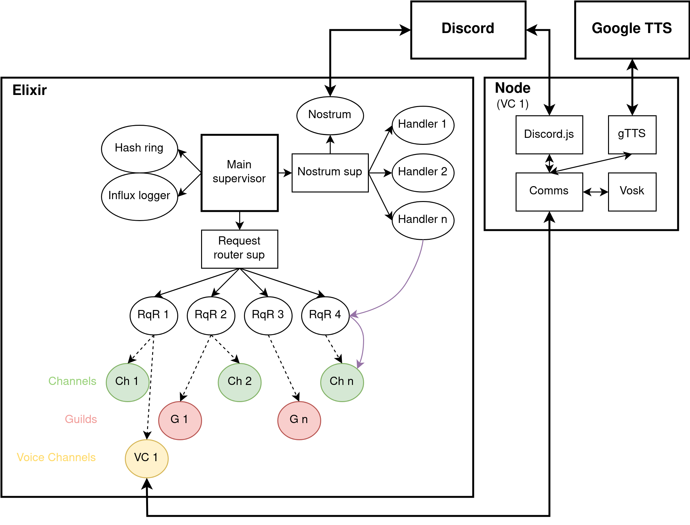

# Deutexrium

Elixir [Deuterium](https://github.com/portasynthinca3/deuterium) rewrite, a Discord bot that automatically generates messages based on the previously seen ones on a per-channel basis.

## Use an existing one
[Invite it to your server](https://discord.com/oauth2/authorize?client_id=733605243396554813&scope=bot%20applications.commands)

## Run your own
Please note that Deuterium uses a [custom permissive license](LICENSE.md). It's only 6 lines long and it's a good idea to read it!

### Setup
  - install Elixir and Mix
  - install InfluxDB v1.x and create a database named `deuterium`, it will be used to store stats
  - (optionally) install and configure Grafana to look at those stats
  - run `mix deps.get`
  - tweak self-explanatory settings in `config/config.exs`

Additional setup for voice channel interaction:
  - install Node and npm
  - run `cd voice && npm i && cd ..`
  - install `ffmpeg` from your system package manager
  - download `en` and `ru` models from [here](https://alphacephei.com/vosk/models), unpack them into `voice/models`

### Running
  - in an interactive session: `DEUTEX_TOKEN=... iex -S mix`
  - generate a release: `MIX_ENV=prod DEUTEX_TOKEN=... mix release`

Note that you have to register slash commands before using them. In order to do that, enter an interactive session and execute one of:
  - `Ctl.add_slash_commands` to register them globally (takes about an hour to update across all servers)
  - `Ctl.add_slash_commands(123)` to register them in the Discord server with ID 123 (instant)

To perform a safe shutdown of the instance, enter an interactive session or connect to a running release and execute `Ctl.shutdown`, or send SIGTERM to a running release. Minor data loss may occur if this function is not run before shutdown.

### Exporting data from the master Deuterium instance
If you own a Discord server that you'd like to be served by a self-hosted instance of this bot and you have used the master one before, you can import existing data. To do that, run the `/export` command of the master instance for both resource types (`channel` and `guild`) and the `etf.gz` format. The three files you received should be placed in the `/var/deutex_data` directory (unless changed in config) on the machine that hosts your Deuterium instance.

## Modification
This internal structure diagram might be helpful:\

